# Экзаменационное задание. Клиент-серверное приложение «Чат»

## Результат

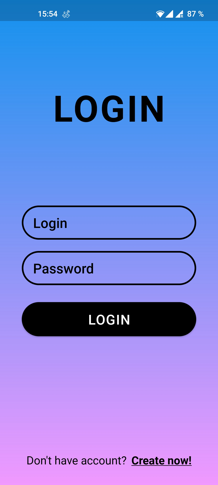 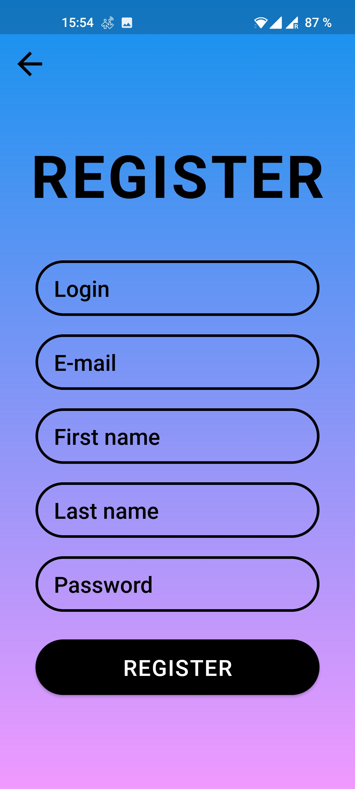 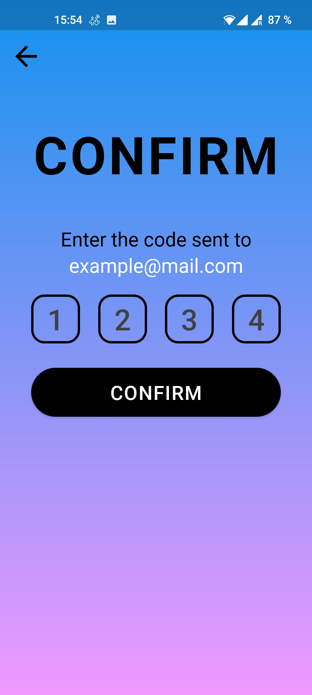 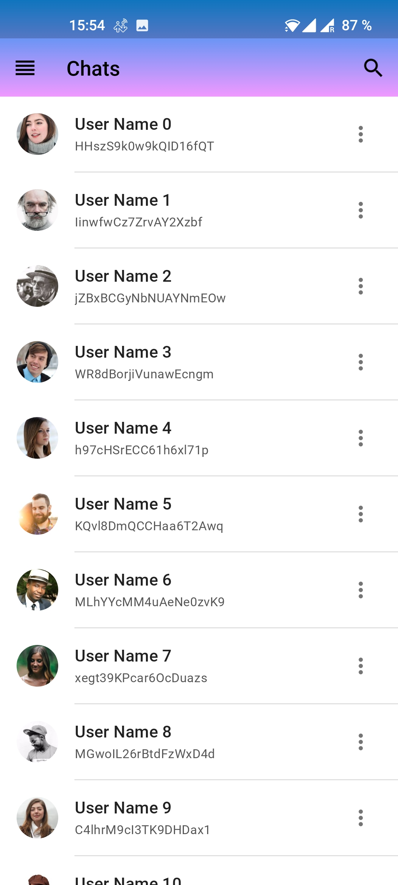 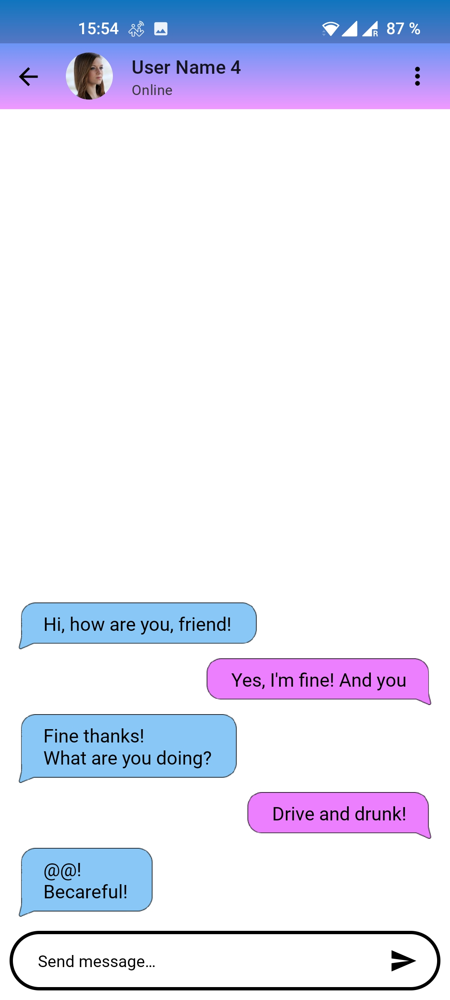 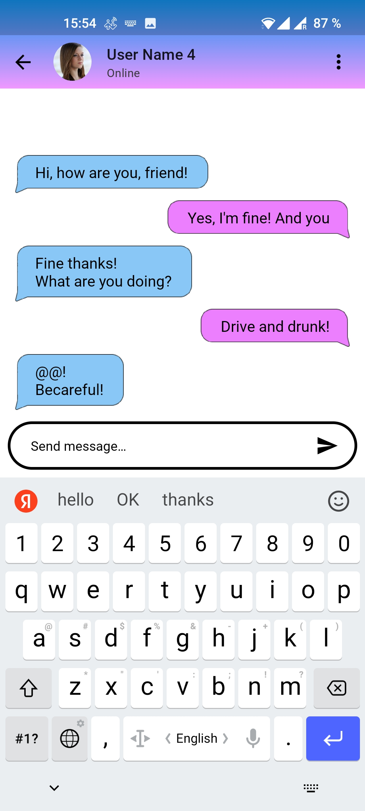 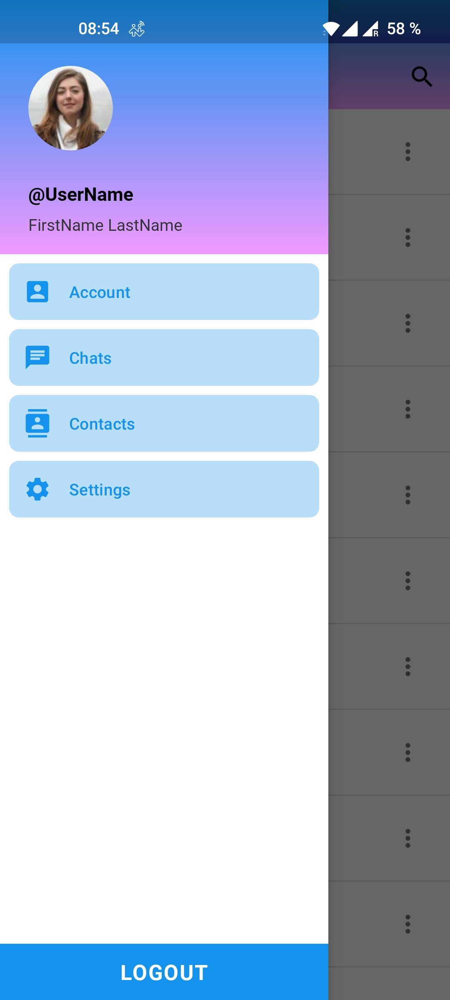 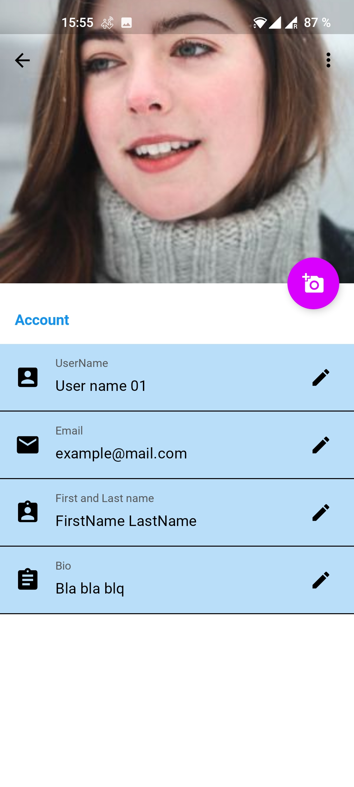

## Задание

В качестве Экзаменационного задания необходимо разработать клиент-серверное приложение «Чат». Перед тем как описывать условия задания, сообщим, что скриншоты которые сопровождают это задание, намеренно выполнены не в стиле Material Design. Но, реализация задания должна быть выполнена в концепции Material Design. И, для усложнения задания, вы должны самостоятельно увидеть элементы и виджеты Material Design, которые должны присутствовать в разработанном вами приложении.

Итак, необходимо разработать клиент-серверное приложение «Чат». При помощи этого приложения пользователи Android устройств смогут общаться друг с другом посредством текстовых сообщений. Клиентом в данной системе будет выступать приложение Android которое необходимо разработать. Для сервера необходимо разработать либо набор сценариев PHP, либо Java приложение, либо сценарии NodeJS — на ваш выбор. Приветствуется, если серверная часть системы будет размещена в сети Интернет (на бесплатном хостинге).

Передача сообщений осуществляется от клиента (мобильного устройства Android) на сервер. Для этого у пользователя Android приложения должна быть возможность ввести текст сообщения и нажать на кнопку «Отправить». Сообщения в «Чате» отправляются от всех участников ко всем участникам (т.е. реализовывать функциональность приватных сообщений не требуется).

Также необходимо предусмотреть выключение тех элементов управления, которые не могут использоваться в текущем состоянии приложения. Например, нельзя нажимать кнопку _«Stop»_, если пользователь перед этим не нажал кнопку _«Start»_.

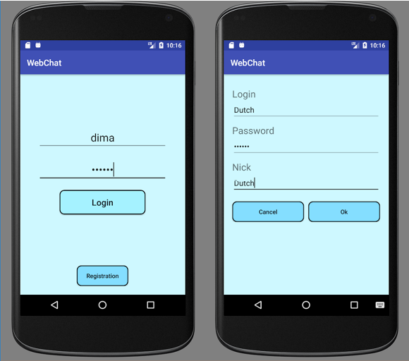 
_**Рис. 1.** Панель ввода логина и пароля (слева) и панель регистрации пользователя чата (справа)_

Получение новых сообщений осуществляется при помощи регулярно посылаемых от клиента специальных запросов. Эти запросы должны отправляться в специальном вторичном потоке. Период отправки таких запросов — 3 секунды. Поток должен получать только новые сообщения, то есть сообщения, которые уже получены от сервера, повторно не должны быть получены.

Получение списка пользователей «online» также осуществляется при помощи регулярно посылаемых от клиента специальных запросов. Эти запросы должны отправляться в еще одном специальном вторичном потоке. Период отправки таких запросов — 5 секунд.

При запуске приложения, пользователь должен ввести свой логин и пароль (см. Рис. 1). Если пользователь не зарегистрирован в системе, то у него должна быть возможность зарегистрироваться (см. Рис. 1). Зарегистрированные пользователи сохраняются на сервере в БД.

Далее, зайдя в чат, пользователь видит сообщения от других пользователей и может отправлять свои сообщения, как показано на Рис. 2.

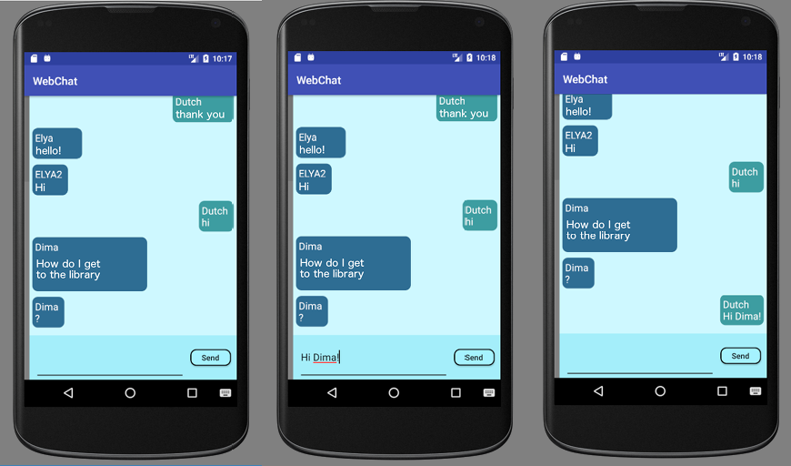 
_**Рис. 2.** Общий вид сообщений чата и отправка пользователем сообщений_

Пользователь чата может видеть список пользователей «online», как показано на Рис. 3.

Как видно из Рис. 3, в списке пользователей отображаются все пользователи, причем пользователи которые находятся сейчас в чате отмечаются зеленым кружком, а отсутствующие пользователи отображаются красным кружком. Что касается списка пользователей «online», то вы можете, по желанию, отображать только пользователей, находящихся сейчас в чате («online»).

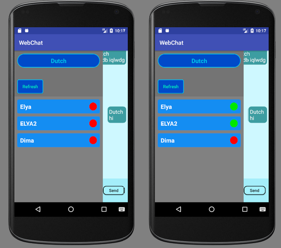 
_**Рис. 3.** Список пользователей «online»_

Еще раз сделаем акцент, каким должно быть клиентское Android приложение — оно должно быть сетевым многопоточным приложением в стиле Material Design и с виджетами из библиотек совместимости.

Желаем вам удачи!
